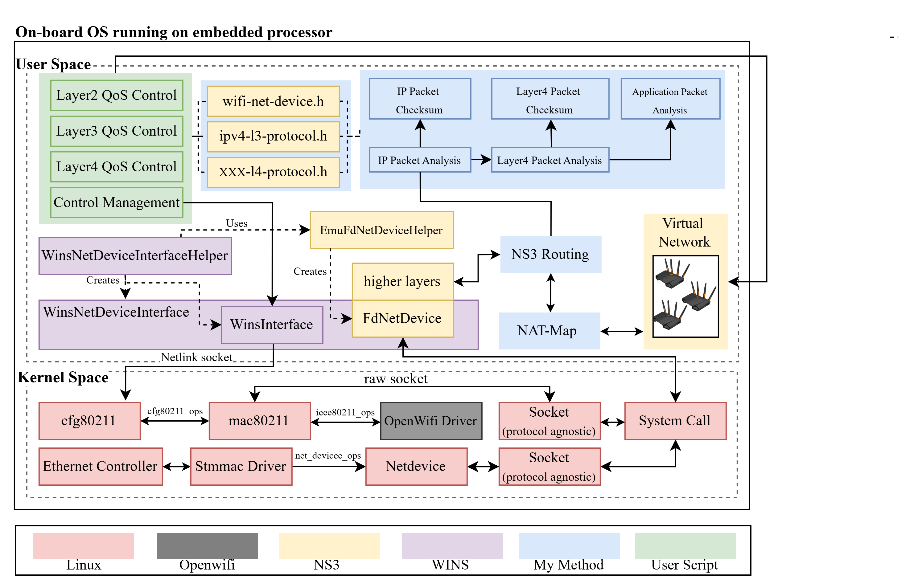
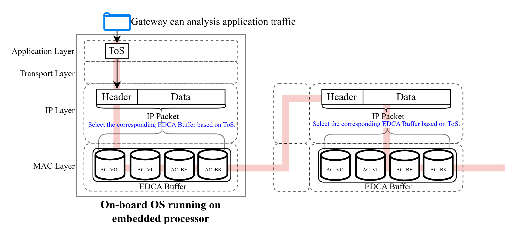
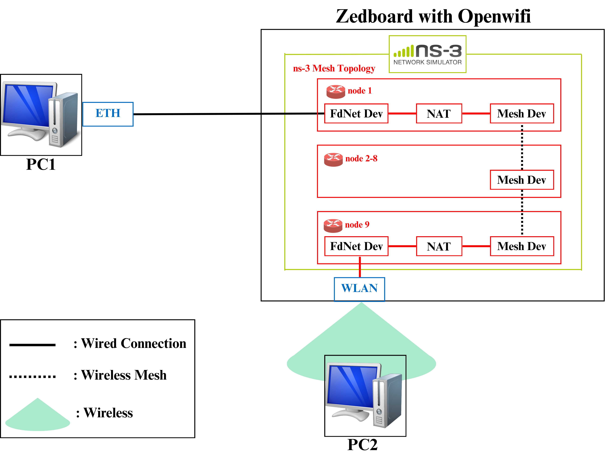
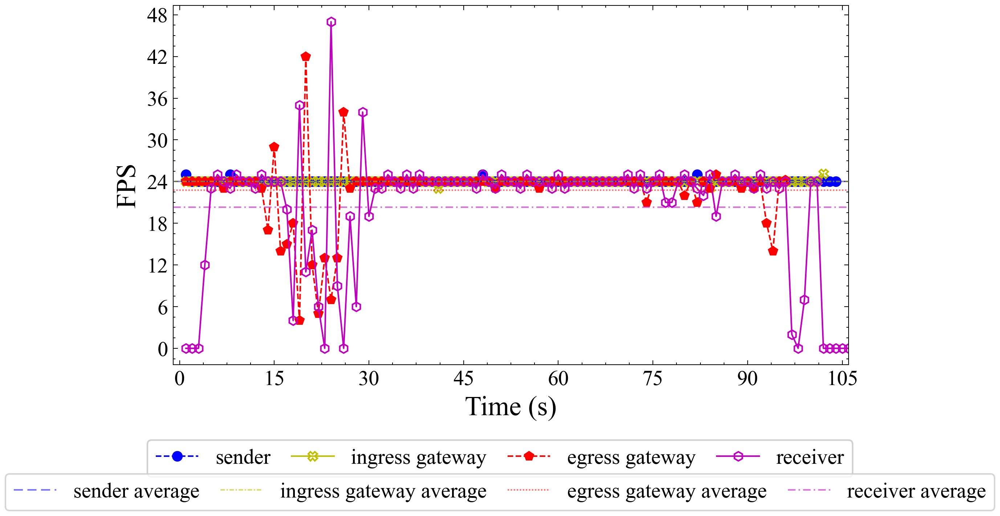
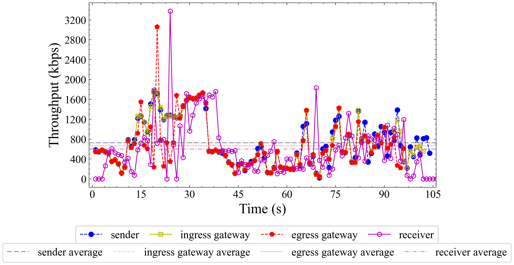
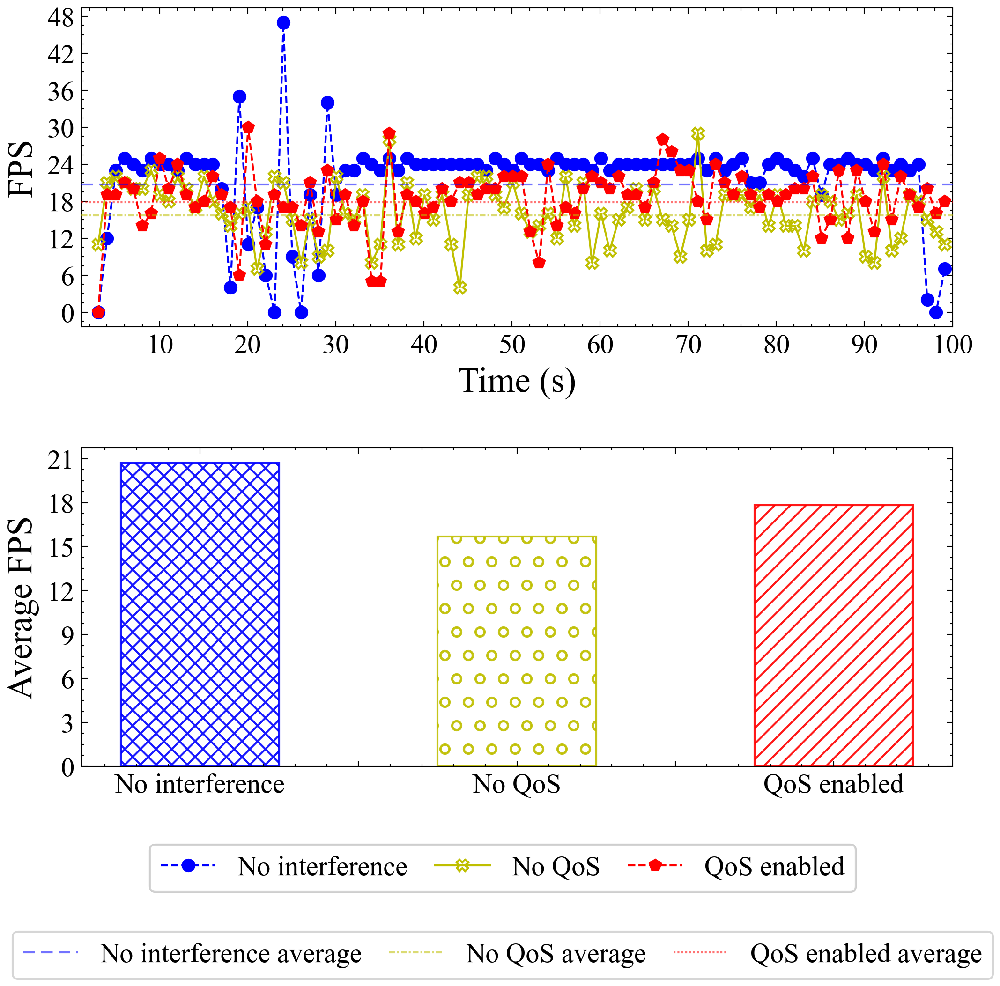
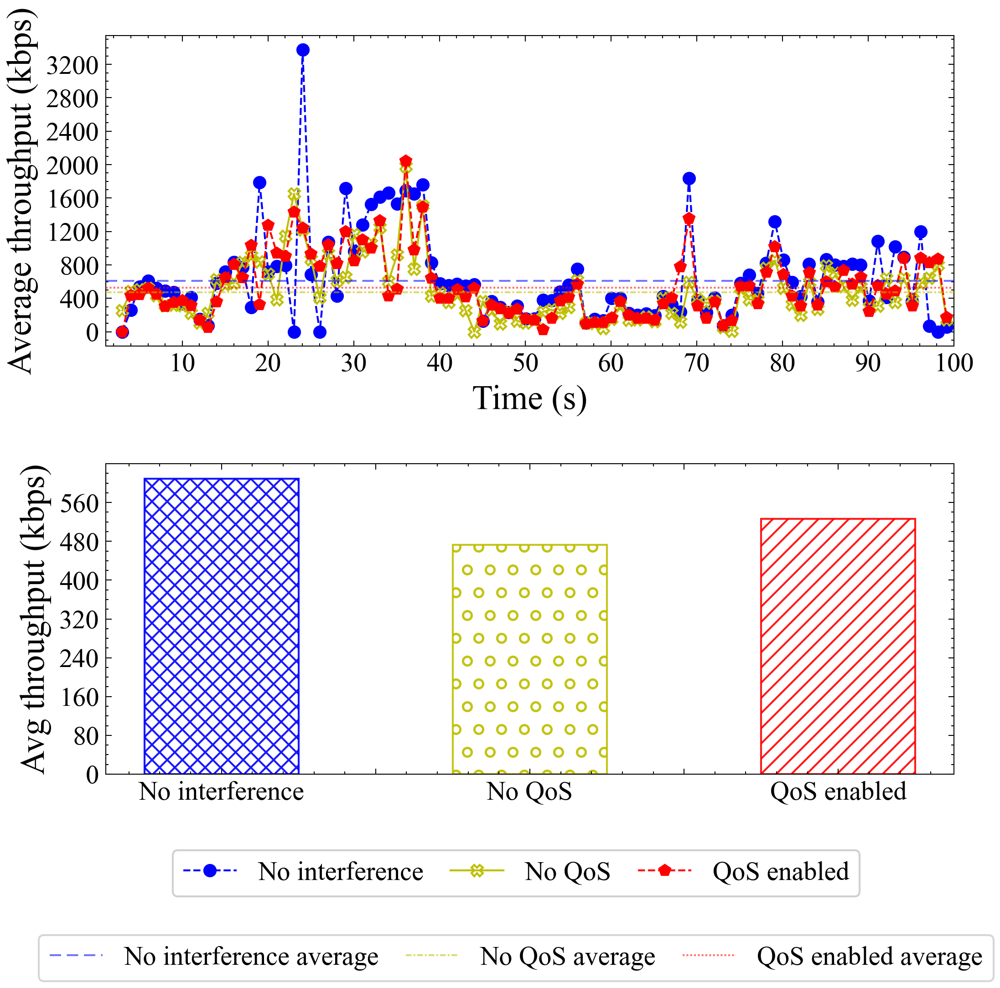

# NS3 OpenWifi 實驗結果總整

## Introducion
+ **研究背景**
    - QoS 的重要性與實現廣泛受到討論，除了傳統的以太網路需QoS外，無線網路也需要 [1]。
    - 現代 QoS 機制通常需要根據不同流量類型或服務需求進行分類，而分類資訊可能來自 IP 層（如 DSCP）或更高層協定 [2][3]。
    - 隨著無線通訊技術持續演進，從 2.4 GHz / 5 GHz Wi-Fi 已逐步延伸至更高頻段的毫米波（millimeter-wave, mmWave）系統，使高頻段無線網路在高吞吐與低延遲應用中的研究逐漸成為重要方向。因此，如何在不同頻段（sub-6 GHz 與 mmWave）之間維持一致的 QoS 與跨層控制能力，亦成為未來無線網路架構設計的重要議題 [4]。

+ **研究缺陷**
    - 常見在無線網路當中實現QoS的實體工具是SDR或是Linux-based embedded router OS，然而傳統 Linux-based embedded router OS 如 OpenWRT 的確可以透過 iptables 等機制解析IP上層資訊，但沒有一個網路研究框架讓研究者方便修改與驗證新的QoS演算法，其次對MAC層的自由度也相對較低，例如對 EDCA 參數（如 contention window、AIFS 等）的細粒度控制與研究彈性有限，較難支援新型 QoS 排程或跨層演算法的快速驗證 [2]。
    - 而MAC層自由度較高的SDR工具則像是OpenWifi，使 EDCA 行為能夠被觀察與調整，但缺乏與上層協定共同研究的架構，這些SDR工具會導致 上層QoS機制或是跨層QoS機制難以實現 [3]。
    - 例如在 Linux 網路架構中，MAC 層的 EDCA 提供四種 CW 相關的優先權分類機制。在一般 WMM/802.11 QoS 的實作流程中，流量分類資訊通常會來自 IP 層（如 DSCP），並在 Linux driver 或網卡實作中映射至對應的 TID，以進一步影響 MAC 層的 EDCA queue 行為 [2]。
    - OpenWRT 雖然可透過指令或修改設定檔調整 EDCA 相關參數，但在實務上通常仍需透過重新載入 wireless 設定或重啟介面來使配置生效，且其調整粒度主要以系統既有介面為主，較難支援細緻或動態的 QoS policy 驅動控制。相較之下，OpenWiFi 雖然提供較低層（如暫存器或 FPGA/driver level）的 EDCA 行為調整能力，但其設計重點仍偏向 MAC/PHY 行為驗證，缺乏與上層 QoS policy（如 DSCP-based 或 application-driven classification）之間的標準化整合介面，因此在跨層 QoS 策略的整體驗證上仍存在落差。

+ **研究問題**
    - 若EDCA機制在只有AP與STA一跳的情況所受影響較小，畢竟最終用戶端(STA)不需要實現一套QoS機制在裡面，反觀多跳mesh網路則不同，若 SDR 中繼節點無法解析在同一個EDCA Buffer當中的不同流量，而缺乏重新分類與重新排程能力，將導致QoS的靈活度只能依賴一開始的發送端而變低，例如在sconn場景 [5] 當中當確認連線的背景流量與使用者應用流量共存時，就有可能因為無法靈活調度QoS導致使用者應用流量受影響。
    - 而跨層所帶來的影響並不局限於MAC層，截至目前已有許多研究指出，無線鏈路品質將直接影響Layer4協定的效能，例如 TCP Veno、Westwood 等皆利用無線資訊改善傳輸層決策，因此跨層研究已成為重要研究方向 [6]。
然而，目前大多數 SDR 平台仍缺乏可直接修改與驗證Layer4~7的研究環境。

+ **相關研究**
    - 在過去，SDR 工具多透過 Linux Socket、iptables 或自行撰寫程式完成上層應用，其實作方式高度依賴個別平台與程式架構，因此缺乏一致的研究介面，不利於不同研究工作的重現與比較 。
    - 而ns3 [7] 作為全球公認的網路模擬開源軟體，這項軟體主要將所有網路行為，利用邏輯模擬的方式實現，儘管phy與mac層無法完全用邏輯的方式替代，但上層的機制卻是能夠使用邏輯達成功能，因此我們發現可以讓sdr 繼續負責它擅長的phy mac領域，將上層的邏輯機制交給大家共認的網路開源軟體ns3處理。

+ **本文貢獻**
    - 因此本文提出一套整合 SDR 與 ns-3 的架構，使真實 SDR 能夠直接執行與控制 ns-3 的 Higher-layer Network Stack，讓 Routing、QoS、Queue Management 與 Cross-layer 演算法能夠直接作用於真實無線流量，而非模擬封包。
    - 實驗挑選開源的sdr工具 openwifi 並採用常見應用影音RTP作為實驗對象 [8]，觀察是否能透過解上層封包，並調用ns3的QoS機制達到Openwifi的EDCA功能，讓 SDR 不再僅作為 PHY/MAC 驗證平台，而可進一步發展為具備網路控制能力的 Wireless Gateway，並且能夠觀察到跨層或是IP上層所造成的無線網路影響。
    - 此外，本架構亦可延伸至毫米波 SDR 平台之系統設計，使高頻段（mmWave）無線環境下之跨層 QoS 與網路控制能力得以進一步驗證與分析，作為未來毫米波網路 gateway 架構之基礎。

## 實驗方法

### 實驗架構

本研究採用使用者空間（User Space）與核心空間（Kernel Space）分層協作的實驗架構，使 NS-3 所建立的虛擬網路堆疊能與真實 Linux 核心及 OpenWiFi 硬體共同運作，如圖所示。此架構的目的並非以模擬器取代實體無線裝置，而是將 NS-3 擅長的上層網路邏輯與 OpenWiFi 所提供的可程式化無線媒介存取控制（Medium Access Control, MAC）及實體層（Physical Layer, PHY）能力結合，使研究者能在接近實機的條件下驗證跨層控制機制。

在Linux架構中，Kernel Space負責驅動實體網路介面並完成封包的最終送收，User Space則執行應用程式與模擬邏輯。本研究將 ns-3 部署於使用者空間，透過 file descriptor 型網路裝置 (FdNetDevices) 與 Kernel Space的網路介面雙向交換封包，使模擬器所建立的虛擬 mesh 能與真實有線及無線鏈路銜接，不必將上層轉發邏輯重寫進 Kernel 當中。核心空間在本架構中主要扮演「實體傳輸通道」的角色。Linux 網路堆疊負責將使用者空間注入的乙太網路幀交由對應的網路裝置處理；乙太網路經過Ethernet controller 與 Stmmac driver 連接外部網段，無線網路則透過 cfg80211 與 mac80211 子系統管理介面設定與 MAC 層排程，最終由 OpenWiFi driver 將無線幀送至 FPGA 射頻前端。
User Space承擔本研究的「網路控制與邏輯模擬」任務。NS-3 在此不僅建立虛擬拓撲，更作為一套可程式化的上層網路堆疊，讓研究者能在接近實機的環境中修改路由、位址轉換、封包分類與統計行為。當實體封包由Kernel進入模擬節點時，系統會先將其送入 NS-3 的 IPv4 協定處理流程，再交由自訂的路由模組決定後續轉發路徑，從而達到 gateway 的功能。Gateway路由模組讓封包進入路由決策前，系統會依 IP、傳輸層標頭行封包分析，辨識不同應用流量；若位址轉換改變了 IP 或傳輸層欄位，則同步重算 IP、TCP 或 User Datagram Protocol (UDP) 的 checksum，以維持下游節點與接收端正確解封。完成解析與標記後，路由模組再依目的網段決定封包應送往 mesh 內部、egress gateway或實體介面。位址轉換則由 Network Address Translation (NAT) map 負責維護連線狀態。當 ingress gateway對外部封包執行 Destination NAT（DNAT）或 egress gateway執行 Source NAT（SNAT）時，系統會以5-tuple為索引建立對應表，記錄原始位址、轉換後位址與反向查詢所需資訊；回程封包抵達時，即可依 map 還原真實 client 位址，並支援 TCP/UDP 連線與 IP 分片等較複雜情境。NAT map 因此不只是單次標頭改寫，而是確保雙向會話在跨網段、跨虛擬網路時仍能持續一致。
為使 ns-3 內建協定物件能真正參與資料處理，本研究並非只做封包鏡像轉送，而是將實體封包注入對應節點的 IPv4 與傳輸層 protocol stack。如此一來，ns-3 內建的 L3/L4 物件即可像一般模擬節點一樣接收、儲存並轉送封包；gateway上的 RTP 統計模組也能在封包通過解析 H.264的 payload，累積 FPS、吞吐、封包數與I-Frame等指標。這使得 ingress 與 egress 兩端的量測結果。在此架構下，研究者無須直接修改 SDR 驅動或 FPGA 韌體，即可在 main 腳本中實作 QoS 與其他控制策略：例如於路由入口依應用類型設定 IP TOS、調整 mesh 各節點的 EDCA 參數，或擴充新的 L4 分類規則。這些控制邏輯可透過 NS-3 既有的 protocol stack 物件下達至模擬網路，進而影響封包進入無線 MAC Buffer 的優先順序；同時，Layer 3 以上的路由、NAT 與統計行為也可作為真實環境中的上層控管系統運作。換言之，SDR 仍負責其擅長的 MAC/ Phy 傳輸，而跨層策略則由 ns-3 與使用者腳本共同完成。

### QoS 機制

本研究之 QoS 設計採跨層方式完成，整體流程為「上層流量辨識 → IP Type of Service (TOS) 標記 → Enhanced Distributed Channel Access (EDCA) 佇列選擇」，如圖所示。此流程與 Linux 無線子系統在 Wi-Fi Multimedia (WMM) / 802.11e 環境下的實務做法相近：先由 IP 層攜帶服務等級資訊，再由 MAC 層依優先權決定封包進入哪一個 EDCA Buffer。本文的差異在於，L4 分類與 TOS 寫入是在 ingress gateway 的路由模組中完成，而非僅依賴核心或驅動內建的固定規則。

當封包由 ingress gateway 進入 mesh 前，系統會先依傳輸層協定與埠號進行封包分析，再寫入 IPv4 TOS 欄位。Real-time Transport Protocol (RTP) 影音流量（UDP destination port = 5004）標記為 TOS = 0xB8，對應 Differentiated Services Code Point (DSCP) 中的 Expedited Forwarding (EF)；Internet Control Message Protocol (ICMP) 探測流量標記為 TOS = 0x08，對應 Class Selector 1 (CS1)；其餘流量則維持 TOS = 0x00，以 Best Effort 方式處理。如此一來，多跳 mesh 的中繼節點不必在每個節點重新解析應用層語意，只要讀取 IP header 中的 TOS/DSCP，即可在後續每一跳做出一致的排程決策。

TOS 標記完成後，ns-3 的 WiFi MAC 會先依 IP Differentiated Services field 的最高三個有效位元映射 User Priority (UP)，再對應至 802.11e 的四個 Access Category，分別為 AC_VO、AC_VI、AC_BE 與 AC_BK。本文設定中，EF（UP = 5）映射至 AC_VI（Video），CS1（UP = 1）映射至 AC_BK（Background），Best Effort 則映射至 AC_BE。此映射邏輯與 Linux mac80211 在選擇 WMM 佇列時所採用的規則一致，亦即先由 IP 服務等級決定 UP，再決定封包進入哪一個 MAC Buffer。

為強化不同流量之間的優先差異，本文進一步調整 mesh 各節點的 EDCA 參數，如下表所示：

| Access Category | AIFSN | CWmin | CWmax |
|:---:|:---:|:---:|:---:|
| AC_VO | 1 | 1 | 3 |
| AC_VI | 2 | 3 | 7 |
| AC_BE | 5 | 15 | 511 |
| AC_BK | 7 | 15 | 1023 |

其中 AIFSN 與 Contention Window (CW) 決定了各 Access Category 在競爭無線信道時的等待時間與退避範圍；數值越小，代表該佇列越容易取得發送機會。因此，當 RTP 與 ICMP 或其他背景流量同時存在時，被標記為 EF 的影音流會進入 AC_VI，並因較小的 AIFSN/CW 而比 CS1 背景流更早被送出，從而在 mesh 中維持相對較高的傳輸優先權。

在現行 Linux 無線驅動中，OpenWiFi 所依賴的 mac80211 框架亦採類似的兩階段映射：IP 層先透過 iptables、traffic control (tc) 或應用程式設定 DSCP/TOS，並反映至 socket buffer 的 priority；MAC 層再由 mac80211 依 priority 或 IP DS field 選擇 WMM EDCA queue，並依 AIFSN/CW 參與信道競爭。本文架構將第一階段的 L4 辨識保留在 ns-3 User Space，由 ingress gateway 在路由入口完成；第二階段的佇列選擇則由 ns-3 WiFi 模型依相同邏輯處理。當封包最終進入真實 OpenWiFi 硬體路徑時，已帶有 TOS 標記的幀仍會進入 mac80211 的 EDCA 佇列。因此，本方法在邏輯上與現行 Linux WMM 實務相容；同時因 ns-3 可程式化調整 EDCA 參數與 L4 分類規則，也提供了較 OpenWRT 設定檔或純 SDR 平台更高的研究彈性。

## 實驗設計與結果

### 實驗場景

本研究採實機與模擬器共存的混合測試床，以 OpenWiFi SDR 平台為核心，將 NS-3 所建立之虛擬 mesh 網路橋接至兩段實體網路，使真實影音流量能穿越模擬的多跳無線環境。如圖所示，傳輸端以有線方式接入閘道前段網路，接收端則經由 SDR 所提供之無線鏈路取得影音流；SDR 與接收端之物理距離約 50 cm，用以代表短距離室內部署情境。

在模擬側，本研究建立 4×3 共 12 個節點的 IEEE 802.11s mesh 網路，節點以網格方式排列，相鄰節點間距 30 m。其中，第 0 號節點擔任 ingress 閘道，橋接傳輸端所在之 192.168.4.0/24 網段，負責位址轉換、上層流量辨識與 QoS 標記；第 9 號節點擔任 egress 閘道，橋接 192.168.1.0/24 網段，負責回程位址轉換與封包校驗；其餘節點則作為 mesh 中繼，於 10.1.1.0/24 網段內執行多跳轉發。

整體資料路徑如下：傳輸端將 H.264/RTP 流送至 ingress 閘道對外位址，閘道依應用類型完成 DNAT 後，將封包送入 mesh；封包歷經多跳無線轉發抵達 egress 閘道，再經 SNAT 送至接收端。背景探測流量（如 ICMP ping）與 RTP 共用相同轉發路徑，用以模擬應用流量與維運流量並存時的競爭行為。

### 實驗設置

實驗流量採預錄 H.264 視訊，以 RTP/UDP 方式傳送，傳輸端維持約 24 fps 的即時節奏；接收端以軟體解碼並統計每秒的畫面幀數（FPS）與有效吞吐（kbps）。除傳輸端與接收端外，ingress 與 egress 閘道亦被動記錄 RTP 封包統計，以便追蹤流量在進入 mesh 前與離開 mesh 後的變化。每次實驗持續 100 s，統計窗口為 1 s；分析時略去前 3 s 暖機期。

**實驗一**旨在驗證 NAT 轉發與應用流量解析是否正確。此時不啟用 QoS，亦不注入背景流量，分別於傳輸端、ingress 閘道、egress 閘道與接收端四處同步量測，觀察端到端指標是否一致。

**實驗二**旨在驗證跨層 QoS 機制是否能在背景干擾下改善接收品質。除無干擾基線外，另設兩組對照：其一在 mesh 中注入高頻 ICMP 背景流但不啟用 QoS；其二在相同干擾下啟用 L3 分類標記與 L2 EDCA 參數調整。背景 ping 由外部主機發送至接收端，間隔 0.1 ms，以製造高強度信道競爭；RTP 與 ping 均經 ingress 閘道進入 mesh，與實驗一相同之轉發路徑。實驗二僅以接收端指標作為主要評估依據。

### 實驗一：NAT 轉發與應用流量解析

圖中比較傳輸端、ingress 閘道、egress 閘道與接收端四點之 FPS 與吞吐隨時間的變化。整體而言，傳輸端與 ingress 閘道之平均 FPS 約為 24 fps，平均吞吐約 729 與 727 kbps，兩者幾乎重合。這表示影音流在進入 mesh 之前，經 DNAT 與上層封包解析後，並未出現明顯遺失或誤判，**NAT 轉發與應用流量解析功能已獲得驗證**。

相較之下，egress 閘道與接收端出現可觀的性能衰減與統計抖動，摘要如下：

| 量測點 | 平均 FPS | 平均吞吐 (kbps) | FPS 範圍 |
|:---:|:---:|:---:|:---:|
| 傳輸端 | 24.03 | 729.4 | 24–25 |
| ingress 閘道 | 23.99 | 727.2 | 23–25 |
| egress 閘道 | 22.75 | 666.9 | 4–42 |
| 接收端 | 20.71 | 609.4 | 0–47 |

傳輸端與 ingress 閘道幾乎不受影響，主因兩者皆位於有線接取段，尚未進入 mesh 多跳環境，信道競爭與佇列延遲極小。自 ingress 至 egress 之間，封包須穿越 4×3 mesh 的多跳 802.11s 路徑，每一跳皆受 MAC 層競爭、重傳與排程影響，平均吞吐因此由約 727 kbps 降至約 667 kbps。mesh 佇列的突發性釋放，更使 egress 閘道在部分 1 秒窗口內出現極端 FPS 值（最低 4 fps、最高 42 fps）；這反映的是統計窗口內的批次到達，而非傳輸端編碼速率本身改變。

接收端指標進一步低於 egress 閘道，平均 FPS 約 20.7 fps、平均吞吐約 609 kbps。除 mesh 尾段傳輸外，接收端統計來自已解碼的顯示幀，受解碼排程與緩衝機制影響：當 egress 以 burst 方式釋出封包時，接收端可能在單一窗口內解出大量幀，或在緩衝耗盡時連續回報零幀，因而放大統計起伏。因此，接收端的額外衰減應歸因於 **mesh 多跳延遲與 burst 效應在解碼端的體現**，而非 NAT 或流量解析錯誤。

在吞吐時間序列上，接收端之起伏波形與 egress 閘道高度相似，但整體向後平移數秒。兩者量測的是同一批封包在不同位置的一秒統計；egress 以封包到達計數，接收端則以解碼完成計數，中間存在傳播延遲與播放緩衝所造成的固定偏移。mesh 佇列造成的 burst 先反映於 egress，再於稍後出現在接收端，故視覺上呈現「egress 抖動之延遲複本」。需注意的是，各量測點使用各自的本地時鐘，若直接以時間軸疊圖，可能造成假性對齊；以封包序列對齊後，可確認兩者 burst 模式一致。

綜言之，實驗一證明轉發與解析邏輯正確（傳輸端 ≈ ingress 閘道），mesh 多跳為主要吞吐損失來源（ingress → egress），接收端之額外抖動則來自解碼端統計效應。

### 實驗二：QoS 機制驗證

實驗二在高頻 ICMP 背景流下，比較無干擾基線、有干擾但未啟用 QoS、以及有干擾且啟用 QoS 三種場景之接收端表現，用以驗證本文所提跨層 QoS 能否在 OpenWiFi 相容架構中改善即時影音服務。

| 場景 | 平均 FPS | 平均吞吐 (kbps) | 相對基線 |
|:---:|:---:|:---:|:---:|
| 無干擾（基線） | 20.71 | 609.4 | — |
| 有干擾、未啟用 QoS | 15.70 | 473.1 | FPS 降 24%，吞吐降 22% |
| 有干擾、啟用 QoS | 17.83 | 526.6 | FPS 降 14%，吞吐降 14% |

由基線至未啟用 QoS 場景，高頻 ping 與 RTP 在 mesh 中以相同優先權競爭信道，背景流大量佔用無線資源，使平均 FPS 由 20.7 降至 15.7，平均吞吐由 609 降至 473 kbps。此結果符合預期：在缺乏服務區分時，即時影音與探測流量相互干擾，接收品質明顯惡化。

啟用 QoS 後，ingress 閘道依協定類型將 RTP 標記為 EF、將 ICMP 標記為 CS1，並配合 mesh 各節點之 EDCA 參數調整，使影音流優先於背景探測流進入較高優先權之存取類別。在此條件下，平均 FPS 回升至 17.8（較未啟用 QoS 提升約 13%），平均吞吐回升至 527 kbps（提升約 11%）。時間序列上，啟用 QoS 後接收端低谷較淺、零幀窗口較少，顯示 EDCA 排程確實縮短了 RTP 在競爭中的等待時間。

然而，啟用 QoS 後之指標仍低於無干擾基線。這是因為本文將 EF 映射至 Video 存取類別（AC_VI），並非最高優先之 Voice 類別；在 0.1 ms 間隔的極高 ping 頻率下，背景流仍會對影音流造成一定競爭。換言之，本機制提供的是 **相對優先保障**，而非完全隔離。整體而言，實驗二表明：在 SDR 與 NS-3 整合架構中，上層流量辨識所驅動的跨層 QoS 策略，能於高強度背景干擾下明顯改善接收端 FPS 與吞吐，驗證所提架構具備讓 OpenWiFi 無線段依流量類型差異化服務之能力。

## Reference

[1] H. Wu, R. Hou, and Y.-Q. Zhang, "Transporting real-time video over the Internet: Challenges and approaches," *Proc. IEEE*, vol. 88, no. 12, pp. 1855–1881, Dec. 2000.

[2] S. Mangold, S. Choi, G. R. Hiertz, O. Klein, and B. Walke, "Analysis of IEEE 802.11e for QoS support in wireless LANs," *IEEE Wireless Commun.*, vol. 10, no. 6, pp. 40–50, Dec. 2003.

[3] Ö. Özkaya, J. Haxhibeqiri, I. Moerman, and J. Hoebeke, "Simulating and validating openwifi W-TSN in ns-3," in *Proc. IEEE Int. Conf. Factory Commun. Syst. (WFCS)*, Toulouse, France, 2024, pp. 1–4.

[4] Y. Wang, C. Chen, and X. Chu, "Performance analysis for hybrid sub-6-GHz-mmWave-THz networks with decoupled and coupled user associations," *IEEE Trans. Wireless Commun.*, vol. 24, no. 8, pp. 6658–6673, Aug. 2025.

[5] C.-Y. Huang, W.-W. Chung, and C.-Y. Liu, "SCONN: Design and implement dual-band wireless networking for smart connection," in *Proc. IEEE VTC-Fall*, Chicago, IL, USA, 2018, pp. 1–5.

[6] C. P. Fu and S. C. Liew, "TCP Veno: TCP enhancement for transmission over wireless access networks," *IEEE J. Sel. Areas Commun.*, vol. 21, no. 2, pp. 216–228, Feb. 2003; S. Mascolo, C. Casetti, M. Gerla, M. Y. Sanadidi, and R. Wang, "TCP Westwood: Congestion window control using bandwidth estimation," in *Proc. IEEE GLOBECOM*, vol. 2, San Antonio, TX, USA, 2001, pp. 702–706.

[7] G. F. Riley and T. R. Henderson, "The ns-3 network simulator," in *Modeling and Tools for Network Simulation*, R. E. Simões, Ed. Berlin, Germany: Springer, 2010, pp. 15–34.

[8] M. Y. Modi and S. Kasula, "Bit rate throttling algorithm on video over RTP," in *Proc. IEEE NUiCONE*, Nagpur, India, 2013, pp. 1–6.

### 引用查證說明

| 編號 | 佐證狀態 | 說明 |
|:---:|:---:|---|
| [1] | ✅ | 綜述即時視訊傳輸挑戰，支持「無線網路亦需 QoS」之論述。 |
| [2] | ✅（已替換） | 原引用 `6130095` 與 QoS/DSCP 主題無關，已改為 Mangold 等人對 802.11e EDCA 與流量分類之分析，可支持 IP 層 DSCP/UP 映射至 MAC EDCA 佇列之機制描述。OpenWRT 參數調整限制為本文實務觀察，非此文献直接論述。 |
| [3] | ⚠️ 部分 | 論述 openwifi 與 ns-3 整合及 MAC/TSN 驗證，支持「openwifi 側重 MAC/PHY、需外部框架補足上層」之論點；未直接討論 L4 應用分類缺口。 |
| [4] | ✅ | 分析 sub-6 GHz 與 mmWave 混合網路效能，支持跨頻段 QoS 議題。 |
| [5] | ✅ | 描述 SCONN 雙頻場景，支持多跳 mesh 中背景與應用流量共存之研究動機。 |
| [6] | ✅（已替換） | 原引用 `4623880` 為醫學影像論文，與 TCP 跨層無關；已改為 TCP Veno 與 TCP Westwood 之原始 IEEE 文献。 |
| [7] | ✅ | ns-3 標準引用（書章節，非 IEEE 期刊）。 |
| [8] | ✅ | 以 RTP 視訊為 QoS 調節對象，支持 RTP 作為實驗流量之合理性。 |